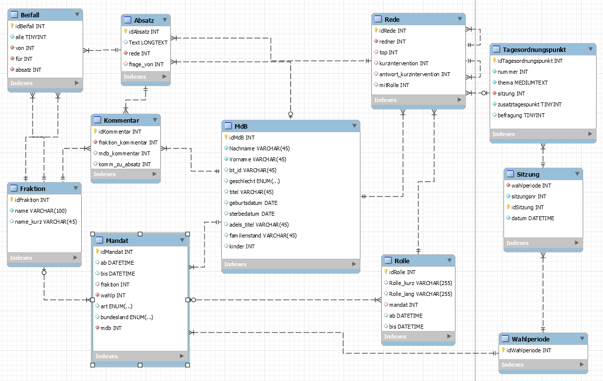

# btplenar

Dieses Programm zieht die erfassten Plenarsitzungen aus dem Bundetag von https://www.bundestag.de/services/opendata runter und pflegt einen großen Teil der Informationen in eine MySql Datenbank ein. 

## requirements
 mysql server https://dev.mysql.com/downloads/mysql/
 
 hilfreich ist außerdem 
 
 https://dev.mysql.com/downloads/workbench/ oder https://dbeaver.io/
 
 Tabellen werden mit [mysql/setup.sql](mysql/setup.sql) generiert werden
 
 

main.py:

  zieht xml dateien von Sitzungen runter
  
  pflegt diese in die Datenbank ein
  
  
## todo
  
  update Sitzungen ohne die komplette Datenbank vorher neu aufzusetzen
  
